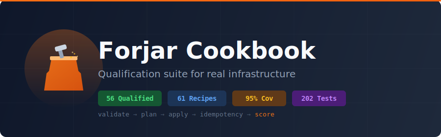

<p align="center">
  
</p>

Qualification suite that proves forjar works on real infrastructure.

Every recipe is a real forjar config applied to real machines. When a recipe
exposes a bug or missing feature, we stop, implement the fix in forjar,
then retry and mark it qualified.

**Primary runner**: Self-hosted Intel (32-core Xeon, 283 GB RAM, 2x AMD GPU)

## Quick Start

```bash
# Validate all recipes
cargo run --example validate_all

# Plan all recipes (dry-run)
cargo run --example plan_all

# Qualify a single recipe on the runner
make qualify-recipe RECIPE=01

# Update README dashboard from CSV
make update-qualifications
```

## Quality Gates

| Gate | Threshold |
|------|-----------|
| Test coverage | >= 95% (`cargo llvm-cov`) |
| Lint | Zero warnings (`cargo clippy -- -D warnings`) |
| Format | Zero diff (`cargo fmt --check`) |
| Code health | `pmat comply check` passes |
| Shell safety | `bashrs lint scripts/ Makefile` |
| Docs | `./scripts/check-docs-consistency.sh` |

## Qualification Dashboard

<!-- QUALIFICATION_TABLE_START -->
**Qualification Summary** (updated: 2026-03-08 13:19 UTC)

| Status | Count |
|--------|-------|
| Qualified | 57 |
| Blocked   | 5 |
| Pending   | 11 |

**Grade Distribution**

| Grade | Count |
|-------|-------|
| A | 0 |
| B | 54 |
| C | 18 |
| D | 1 |
| F | 0 |

| # | Recipe | Category | Status | Grade | Tier | Idempotent | Time (1st) | Time (2nd) | Score | Blocker |
|---|--------|----------|--------|-------|------|------------|------------|------------|-------|---------|
| 1 | developer-workstation | infra |  |  | 2+3 | Strong | 7.6s | 408ms | 88 | — |
| 2 | web-server | infra |  |  | 2+3 | Strong | 11.5s | 971ms | 88 | — |
| 3 | postgresql-database | infra |  |  | 2+3 | Strong | 17.6s | 364ms | 88 | — |
| 4 | monitoring-stack | infra |  |  | 2+3 | Weak | 9.2s | 429ms | 87 | — |
| 5 | redis-cache | infra |  |  | 2+3 | Weak | 9.1s | 382ms | 87 | — |
| 6 | ci-runner | infra |  |  | 3 | Strong | 8.1s | 363ms | 88 | — |
| 7 | rocm-gpu | gpu |  |  | 3 | Strong | — | — | 36 | FJ-1126: ROCm userspace not installed |
| 8 | nvidia-gpu | gpu |  |  | 3 | Strong | — | — | 37 | FJ-1127: No NVIDIA hardware |
| 9 | secure-baseline | infra |  |  | 2+3 | Strong | 36.8s | 355ms | 87 | — |
| 10 | nfs-file-server | infra |  |  | 3 | Strong | — | — | 41 | FJ-1128: NFS kernel modules not loaded |
| 11 | dev-shell | nix |  |  | 1+2 | Strong | 714ms | 22ms | 88 | — |
| 12 | toolchain-pin | nix |  |  | 1+2 | Strong | 980ms | 21ms | 89 | — |
| 13 | build-sandbox | nix |  |  | 1+2 | Strong | 639ms | 21ms | 88 | — |
| 14 | system-profile | nix |  |  | 1+2 | Strong | 1.5s | 23ms | 88 | — |
| 15 | workspace | nix |  |  | 1+2 | Strong | 1.3s | 25ms | 87 | — |
| 16 | rust-release | rust |  |  | 1+2 | Strong | 712ms | 22ms | 81 | — |
| 17 | static-musl | rust |  |  | 1+2 | Strong | 906ms | 22ms | 81 | — |
| 18 | multi-stage-build | rust |  |  | 1+2 | Strong | 6.9s | 36ms | 82 | — |
| 19 | cross-compile | rust |  |  | 1+2 | Strong | 1.1s | 22ms | 81 | — |
| 20 | sovereign-stack | advanced |  |  | 2+3 | Strong | 1.2s | 21ms | 88 | — |
| 21 | apr-model | advanced |  |  | 3 | Weak | 1.5s | 24ms | 80 | — |
| 22 | secrets-lifecycle | advanced |  |  | 2+3 | Strong | — | — | 41 | FJ-1129: Secret provider exec fails |
| 23 | tls-certificates | advanced |  |  | 2+3 | Strong | 1.1s | 23ms | 88 | — |
| 24 | fleet-provisioning | advanced |  |  | 2+3 | Strong | 1.2s | 21ms | 88 | — |
| 25 | apt-repo | packages |  |  | 2+3 | Strong | 883ms | 22ms | 81 | — |
| 26 | deb-package | packages |  |  | 2+3 | Strong | 1.1s | 23ms | 88 | — |
| 27 | private-apt-repo | packages |  |  | 2+3 | Strong | — | — | 40 | FJ-1130: GPG key import fails |
| 28 | rpm-build | packages |  |  | 2+3 | Strong | 1.1s | 24ms | 88 | — |
| 29 | distribution-pipeline | packages |  |  | 2+3 | Strong | 1.2s | 21ms | 88 | — |
| 30 | saved-plan | opentofu |  |  | 1+2 | Strong | 833ms | 22ms | 88 | — |
| 31 | json-plan | opentofu |  |  | 1+2 | Strong | 764ms | 21ms | 88 | — |
| 32 | check-blocks | opentofu |  |  | 1+2 | Strong | 809ms | 210ms | 86 | — |
| 33 | lifecycle | opentofu |  |  | 1+2 | Strong | 921ms | 22ms | 88 | — |
| 34 | moved-blocks | opentofu |  |  | 1+2 | Strong | 508ms | 22ms | 88 | — |
| 35 | refresh-only | opentofu |  |  | 1+2 | Strong | 738ms | 19ms | 88 | — |
| 36 | resource-targeting | opentofu |  |  | 1+2 | Strong | 843ms | 22ms | 88 | — |
| 37 | testing-dsl | opentofu |  |  | 1+2 | Strong | 713ms | 22ms | 88 | — |
| 38 | state-encryption | opentofu |  |  | 1+2 | Strong | 968ms | 22ms | 87 | — |
| 39 | cross-config | opentofu |  |  | 1+2 | Strong | 736ms | 23ms | 88 | — |
| 40 | scheduled-tasks | linux |  |  | 2+3 | Strong | 1.2s | 21ms | 89 | — |
| 41 | user-provisioning | linux |  |  | 2+3 | Strong | 375ms | 22ms | 89 | — |
| 42 | kernel-tuning | linux |  |  | 2+3 | Strong | 910ms | 20ms | 89 | — |
| 43 | log-management | linux |  |  | 2+3 | Strong | 1.0s | 22ms | 88 | — |
| 44 | time-sync | linux |  |  | 2+3 | Strong | 810ms | 21ms | 88 | — |
| 45 | custom-systemd-units | linux |  |  | 2+3 | Strong | 970ms | 20ms | 89 | — |
| 46 | resource-limits | linux |  |  | 2+3 | Strong | 758ms | 22ms | 89 | — |
| 47 | automated-patching | linux |  |  | 2+3 | Strong | 988ms | 21ms | 88 | — |
| 48 | hostname-locale-dns | linux |  |  | 2+3 | Strong | 1.0s | 19ms | 89 | — |
| 49 | swap-memory | linux |  |  | 3 | Weak | 711ms | 22ms | 87 | — |
| 50 | failure-partial-apply | failure |  |  | 2+3 | Strong | 788ms | 23ms | 88 | — |
| 51 | failure-state-recovery | failure |  |  | 2+3 | Strong | 936ms | 24ms | 88 | — |
| 52 | failure-idempotent-crash | failure |  |  | 2+3 | Strong | 695ms | 22ms | 89 | — |
| 53 | stack-dev-server | composability |  |  | 2+3 | Strong | 1.1s | 23ms | 88 | — |
| 54 | stack-web-production | composability |  |  | 2+3 | Strong | 1.3s | 22ms | 88 | — |
| 55 | stack-gpu-lab | composability |  |  | 3 | Strong | 1.1s | 21ms | 88 | — |
| 56 | stack-build-farm | composability |  |  | 2+3 | Strong | 1.2s | 22ms | 88 | — |
| 57 | stack-package-pipeline | composability |  |  | 2+3 | Strong | 1.3s | 21ms | 88 | — |
| 58 | stack-ml-inference | composability |  |  | 3 | Weak | 1.3s | 21ms | 86 | — |
| 59 | stack-ci-infrastructure | composability |  |  | 2+3 | Strong | 1.1s | 21ms | 88 | — |
| 60 | stack-sovereign-ai | composability |  |  | 3 | Strong | 1.8s | 22ms | 88 | — |
| 61 | stack-fleet-baseline | composability |  |  | 2+3 | Strong | 1.2s | 42ms | 88 | — |
| 62 | stack-cross-distro | composability |  |  | 2+3 | Strong | 1.3s | 22ms | 88 | — |
| 88 | wireguard-vpn | infra |  |  | 2+3 | Strong | — | — | 41 | — |
| 89 | postgresql-replication | infra |  |  | 2+3 | Strong | — | — | 41 | — |
| 90 | haproxy-ha | infra |  |  | 2+3 | Strong | — | — | 41 | — |
| 91 | podman-rootless | infra |  |  | 2+3 | Strong | — | — | 40 | — |
| 92 | cis-hardening | infra |  |  | 2+3 | Strong | — | — | 40 | — |
| 93 | k3s-cluster | infra |  |  | 2+3 | Strong | — | — | 32 | — |
| 94 | canary-deployment | devops |  |  | 2+3 | Strong | — | — | 32 | — |
| 95 | otel-collector | infra |  |  | 2+3 | Strong | — | — | 34 | — |
| 96 | oci-image-build | platform |  |  | 2+3 | Strong | — | — | 41 | — |
| 97 | task-pipeline-gates | platform |  |  | 2+3 | Strong | — | — | 41 | — |
| 98 | recipe-signing | platform |  |  | 2+3 | Strong | — | — | 41 | — |
<!-- QUALIFICATION_TABLE_END -->

## License

MIT
